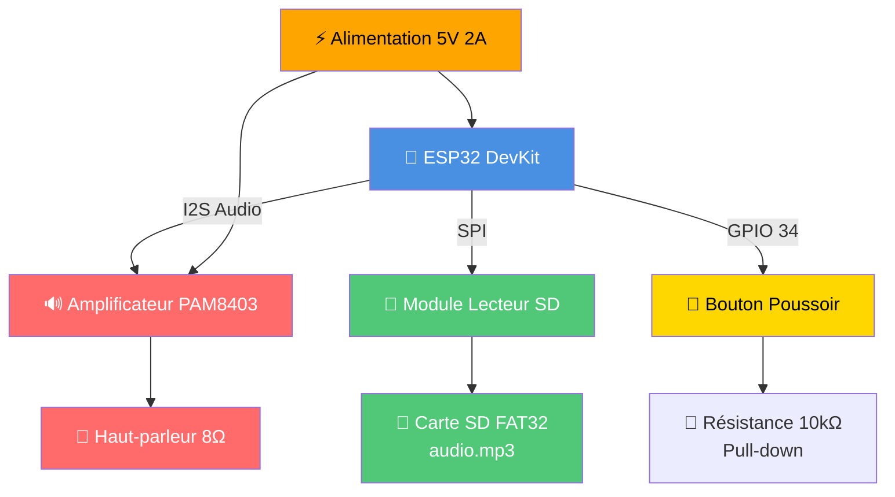
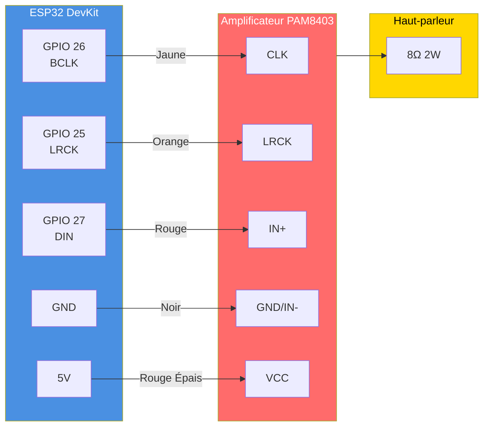
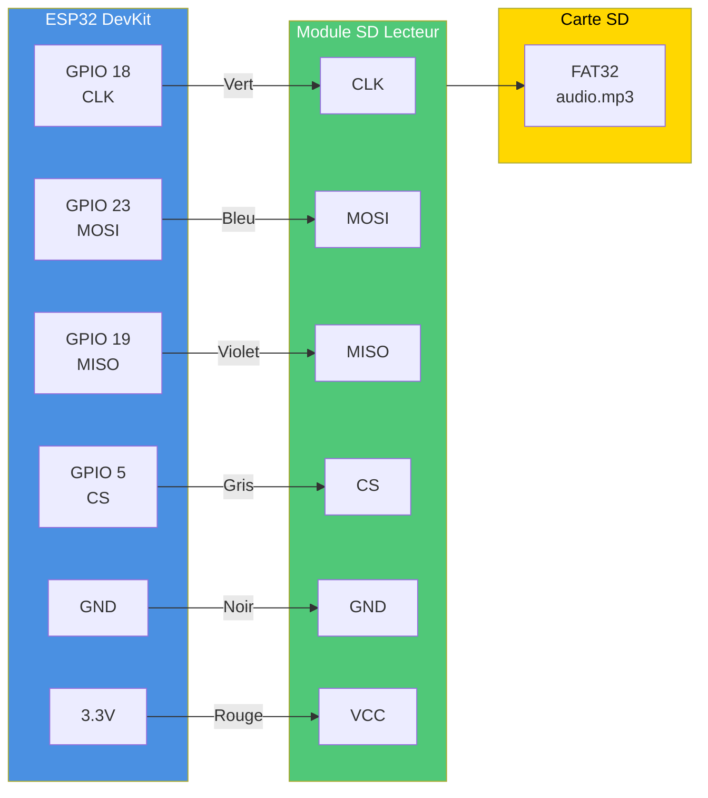
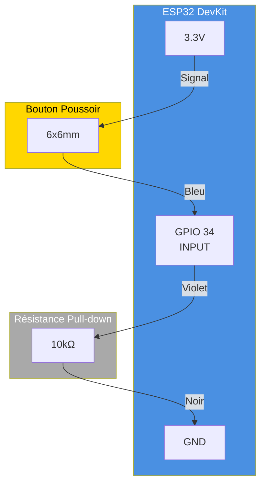
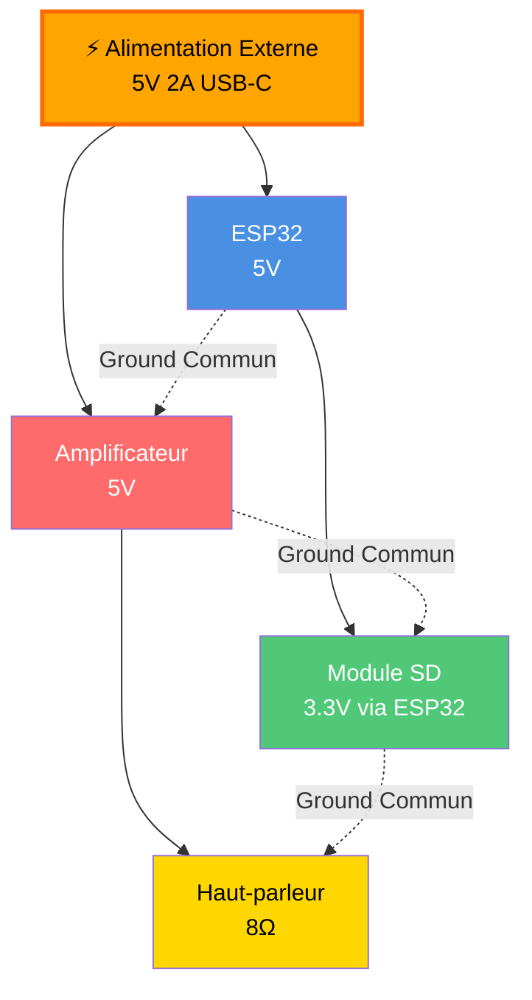
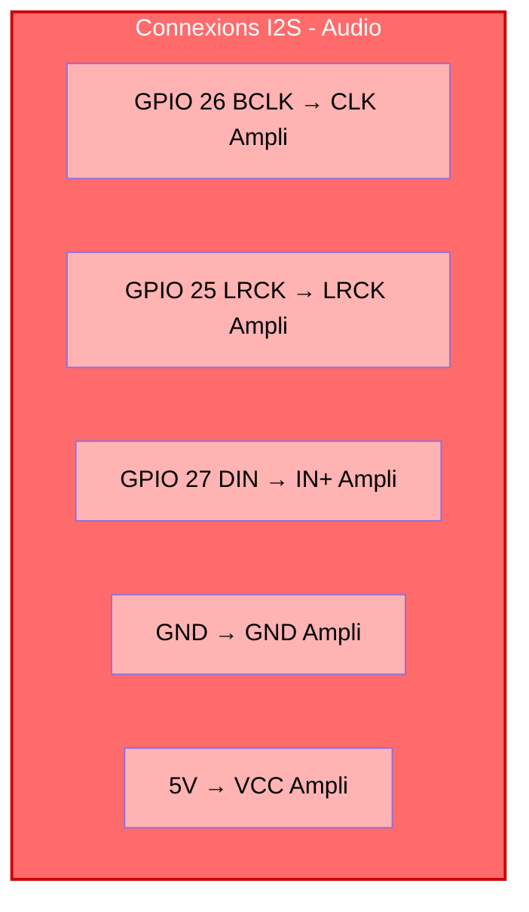
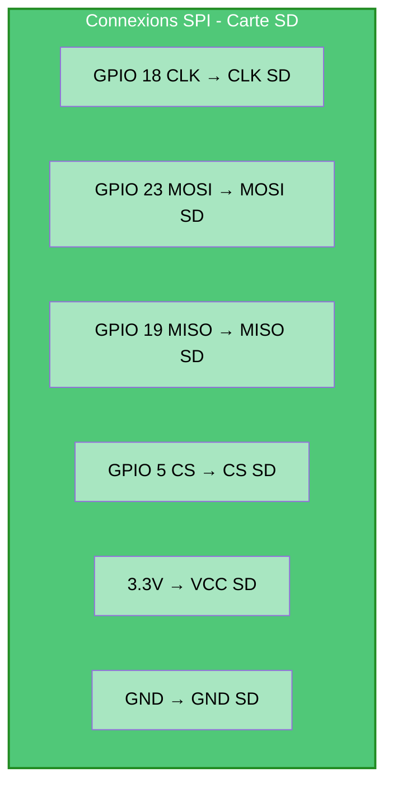
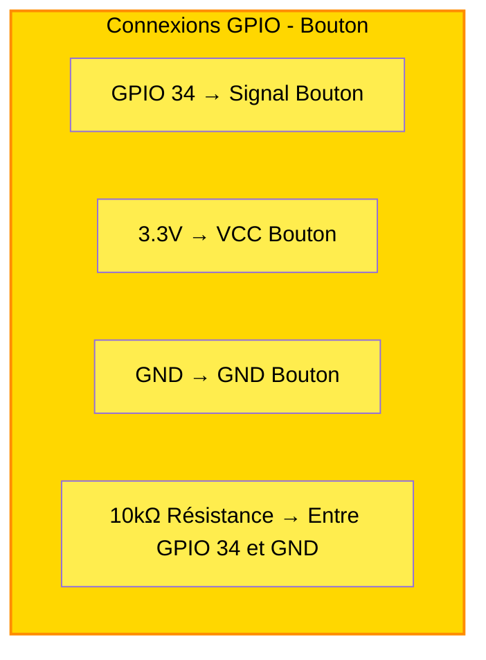
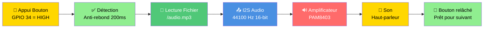

# 📊 Schémas Visuels Mermaid

## Vue d'ensemble du système

---

## Schéma I2S - Audio

---

## Schéma SPI - Carte SD

---

## Schéma GPIO - Bouton

---

## Schéma Alimentation

---

## Tableau Récapitulatif I2S

---

## Tableau Récapitulatif SPI

---

## Tableau Récapitulatif GPIO

---

## Flux de Fonctionnement

---

**Schémas Mermaid - Escape Game Factory - 2026-09-10**
